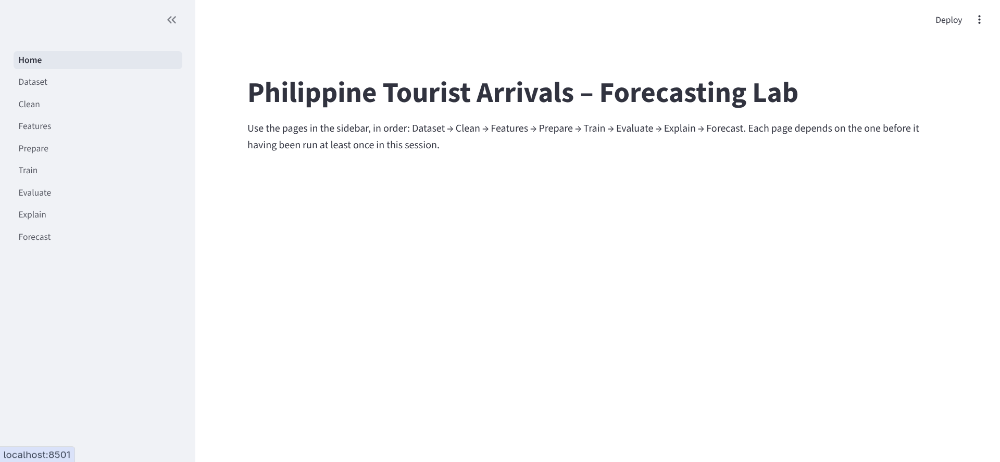
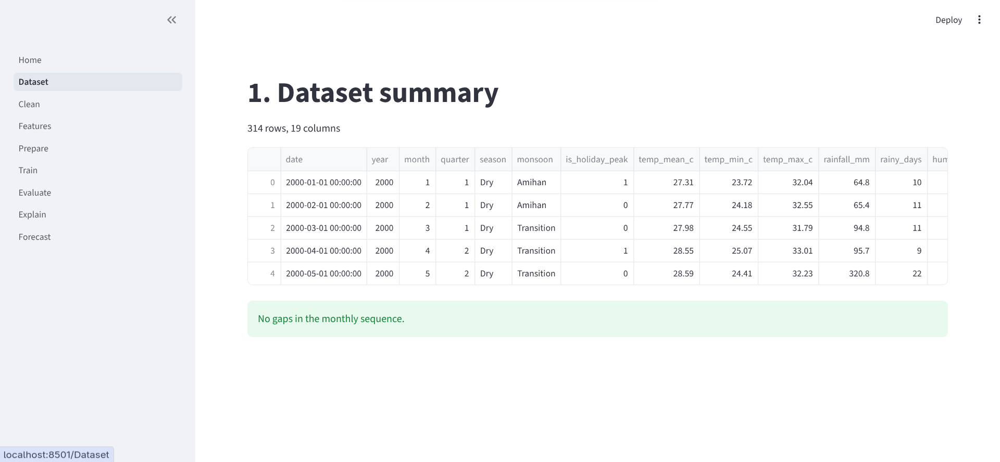
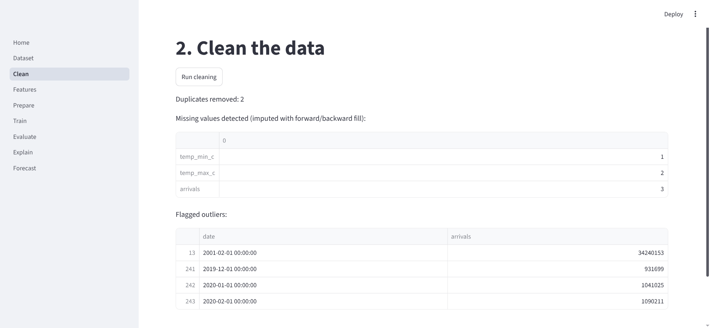
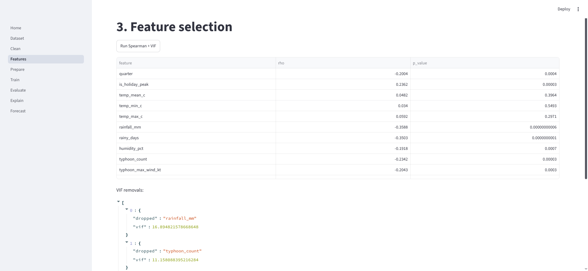
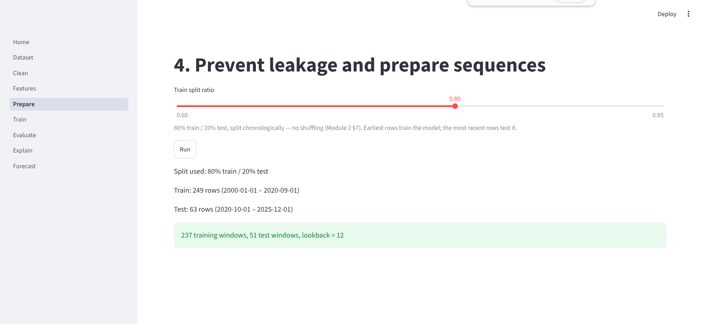
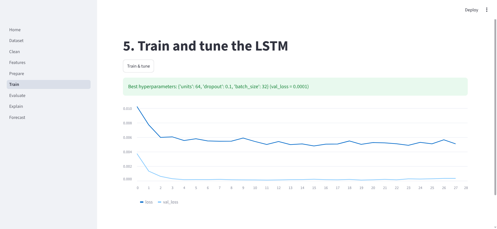
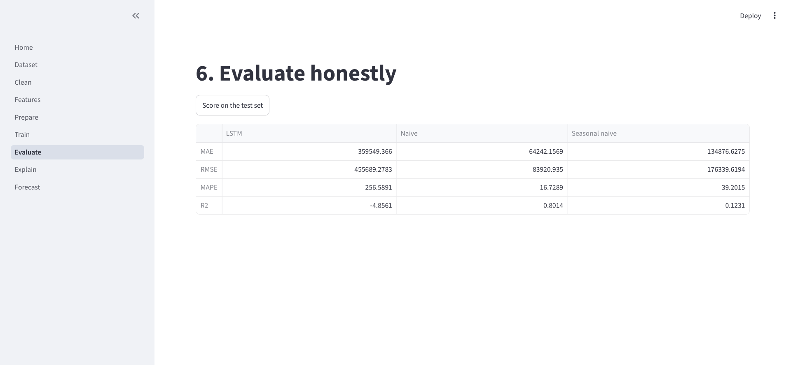
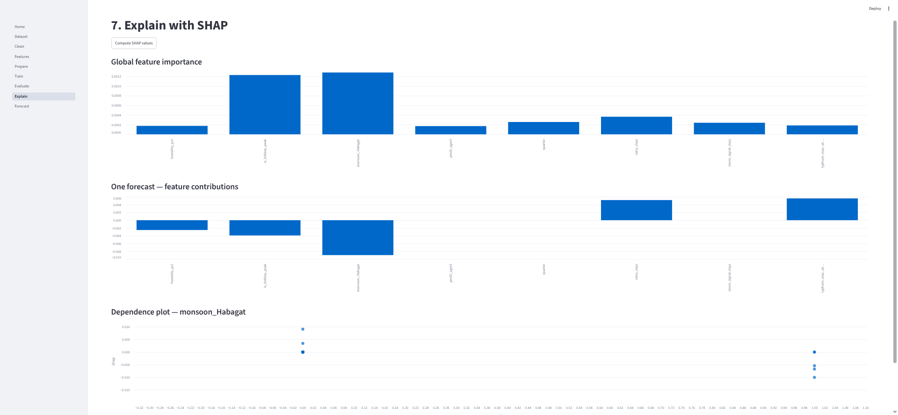

# Philippine Tourist Arrivals – Forecasting Lab

A Streamlit multi-page app that walks through the full pipeline for forecasting monthly tourist arrivals in the Philippines using an LSTM model. Built for ITD105.

## Screenshots

| Step | Preview |
|------|---------|
| 1. Dataset |  |
| 2. Clean |  |
| 3. Features |  |
| 4. Prepare |  |
| 5. Train |  |
| 6. Evaluate |  |
| 7. Explain |  |
| 8. Forecast |  |

## What it does

The app has eight pages that must be run in order. Each page depends on the previous one having been run in the same session.

| Step | Page | What happens |
|------|------|--------------|
| 1 | Dataset | Loads `tourist_arrivals.csv`, shows row/column counts, checks for gaps in the monthly sequence |
| 2 | Clean | Removes duplicate dates, one-hot encodes season/monsoon columns, imputes missing values with forward/backward fill, flags IQR outliers on arrivals |
| 3 | Features | Runs Spearman correlation filter (|rho| > 0.10, p < 0.05), then iterative VIF pruning (threshold 5) to select a final feature set |
| 4 | Prepare | Splits data chronologically (no shuffling), fits MinMaxScaler on the training set only, builds 12-month lookback sequences for both splits |
| 5 | Train | Grid-searches over LSTM units (32, 64), dropout (0.1, 0.3), and batch size (16, 32) using early stopping; keeps the best checkpoint by validation loss |
| 6 | Evaluate | Scores the LSTM on the held-out test set against two baselines: naive (previous month) and seasonal naive (same month one year prior), reporting MAE, RMSE, MAPE, and R2 |
| 7 | Explain | Computes SHAP values via KernelExplainer (black-box, 50-sample background, k-means summary) and shows global feature importance, per-forecast contributions, and a dependence plot for the top feature |
| 8 | Forecast | Lets you edit the last 12 months of feature readings and predicts next month's arrivals |

## Dataset

`Lab1/data/tourist_arrivals.csv` contains monthly records from January 2000 onward. Each row covers one calendar month with the following columns:

- **Temporal:** `date`, `year`, `month`, `quarter`
- **Seasonal:** `season` (Dry/Wet), `monsoon` (Amihan/Habagat/Transition)
- **Calendar flag:** `is_holiday_peak`
- **Weather:** `temp_mean_c`, `temp_min_c`, `temp_max_c`, `rainfall_mm`, `rainy_days`, `humidity_pct`
- **Typhoon:** `typhoon_count`, `typhoon_max_wind_kt`, `storm_signal_days`
- **Air/sea:** `pm25_ugm3`, `wave_height_m`
- **Target:** `arrivals`

## Setup

Python 3.10+ recommended.

```bash
cd Lab1
pip install -r requirements.txt
streamlit run Home.py
```

Then open the URL Streamlit prints (usually `http://localhost:8501`) and follow the sidebar pages in order.

## Dependencies

| Package | Purpose |
|---------|---------|
| `streamlit` | App framework and session state |
| `pandas` | Data loading and cleaning |
| `numpy` | Array operations and sequence building |
| `scipy` | Spearman correlation |
| `statsmodels` | Variance inflation factor |
| `scikit-learn` | MinMaxScaler |
| `tensorflow` | LSTM model (Keras API) |
| `shap` | Model explanation via KernelExplainer |

## Notes

- The scaler is fit on training data only. Applying it to the test split before fitting would be data leakage. The Prepare page makes this explicit.
- The LSTM grid search runs up to 8 combinations (2 units x 2 dropout x 2 batch sizes) with early stopping at patience 8 over a maximum of 100 epochs. Training time depends on hardware.
- The SHAP step uses KernelExplainer rather than DeepExplainer because the TensorFlow version in use does not register the custom gradients required for LSTM internals.
- Session state is not persisted between browser refreshes. If you reload the page, start from step 1 again.
